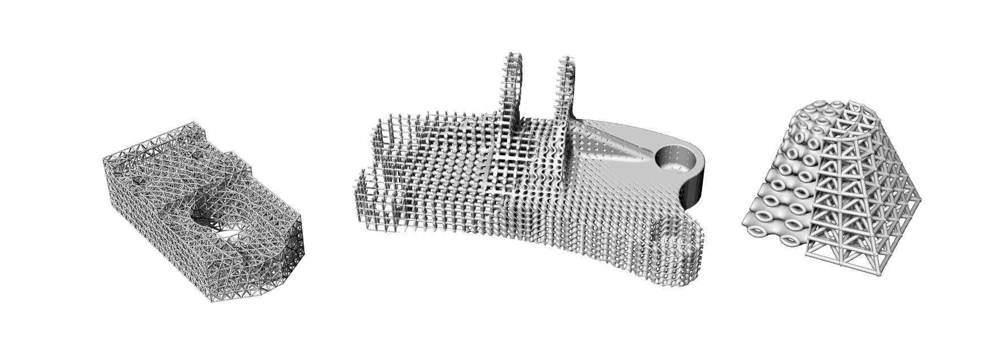

# Artisan

Artisan generates lattice structures using implicit modelling. It combines Python workflow control with C++ computation for geometry processing, lattice generation, meshing, and finite element analysis (FEA) export.

This repository includes the Artisan engine, example workflows, documentation, and the source code for **ArtGUI**, the desktop workflow editor and 3D viewer.



## Features

- Periodic lattices, mesh-based lattices, and conformal lattice structures.
- Strut, triply periodic minimal surface (TPMS), and geometry-based unit cells.
- Custom lattice definitions using points and connections, implicit expressions, or geometry files.
- Geometry operations, scalar and vector fields, surface and volume meshing, and mesh processing.
- FEA workflows with beam, shell, and tetrahedral meshes, plus field evaluation at specified points.
- Adaptive domain partitioning to reduce memory requirements for large models.
- OpenMP acceleration and experimental GPU support for selected operations.

## ArtGUI desktop application

The new ArtGUI replaces the legacy Python/Tk GUI. It is built with Tauri, Rust, JavaScript, and Three.js.

- Organize source geometry, reference geometry, supporting files, and lattice definitions in the Project panel.
- Build ordered workflows with 65 operation types and 371 example presets. Find operations through search, Common, Recent, and Favorites.
- Define custom unit cells with Hex, Tet, Quad, or Triangle reference domains.
- Preview STL, OBJ, PLY, and supported INP meshes. Inspect bounding-box coordinates and X/Y/Z lengths, change visibility, create sections, and take measurements.
- Navigate using Orbit, Pan, and Zoom tools.
- Follow generation through compact progress information and logs, with cancellation support.
- Run either an `ArtisanMain.py` or `ArtisanMain.exe` backend.

### Start ArtGUI from source on Windows

Install the following prerequisites if they are not already available:

- **Node.js with npm:** download the **LTS Windows installer** from the [official Node.js download page](https://nodejs.org/en/download). The installer includes npm.
- **Microsoft C++ Build Tools and Windows SDK:** install [Build Tools for Visual Studio](https://visualstudio.microsoft.com/visual-cpp-build-tools/) and select **Desktop development with C++**, including the MSVC compiler tools and a Windows SDK. These development tools are **not included with Windows by default**. If Visual Studio already has this workload and SDK installed, no separate Build Tools installation is needed.
- **Rust and Cargo:** use the installer from the [official Rust installation page](https://rust-lang.org/tools/install/). Cargo is included. Choose the default **MSVC** toolchain for Windows (the host name ends in `-pc-windows-msvc`).
- **Microsoft Edge WebView2 Runtime:** included with Windows 11 and already installed on most Windows 10 computers. No additional installation is needed when the runtime is present. If it is missing, install the **Evergreen Bootstrapper** from the [official WebView2 download page](https://developer.microsoft.com/en-us/microsoft-edge/webview2/#download-section). See Microsoft's [WebView2 availability guidance](https://learn.microsoft.com/en-us/microsoft-edge/webview2/concepts/distribution#the-evergreen-runtime-distribution-mode).

Node.js, Rust/Cargo, and the C++ build tools are required to build ArtGUI from source; users running a prebuilt ArtGUI application only need the WebView2 Runtime and their chosen Artisan engine's dependencies.

After installing the prerequisites, reopen your terminal. From the repository root:

```powershell
cd ArtGUI
npm ci
npm run dev
```

The repository contains GUI source, required assets, dependency manifests, and lockfiles. Installed libraries, caches, build outputs, and bundled engine runtimes are excluded. `npm ci` restores JavaScript dependencies and the local Three.js viewer files; Cargo restores Rust dependencies during the first build. Internet access is needed to download dependencies.

### Select an engine

In ArtGUI, click **Backend…**:

1. Select `ArtisanMain.py` from this repository, or select a separately packaged `ArtisanMain.exe`.
2. For a Python backend, select `python.exe` from the environment containing Artisan's dependencies. Leave the interpreter field empty to use `python` from PATH.
3. Open or create a workflow, check its geometry and output paths, save it, and choose **Generate model**.

The backend choice is remembered locally. Installing GUI build dependencies does not install the engine's Python dependencies; follow the engine setup below when using `ArtisanMain.py`.

See the [ArtGUI guide](ArtGUI/README.md) for installer builds, optional engine bundling, development checks, and detailed setup. The default GUI installer uses an external engine selected through **Backend…**.

## Artisan engine setup

The Python package requires **Python 3.11** and the dependencies listed in [requirements.txt](requirements.txt). From the repository root, using the Python environment intended for Artisan:

```powershell
python -m pip install -r requirements.txt
```

Keep `ArtisanMain.py`, the `Artisan/` directory, and `pyarmor_runtime_004785/` together in their supplied layout.

GPU acceleration is optional and experimental. The distributed engine's requirements list CUDA Toolkit versions 10.2, 11.0, 11.1, 11.2, 11.3, 11.4, and 11.5, with an NVIDIA GPU supporting compute capability 3.0 or later. Use the CUDA runtime compatible with your engine build; these requirements are separate from ArtGUI's WebGL viewer.

## Command-line usage

Run a JSON workflow from the repository root:

```powershell
python ArtisanMain.py -f "path/to/workflow.json"
```

For example:

```powershell
python ArtisanMain.py -f "Test_json/EngineBracket_HS_Infill_Lin_LR.json"
```

For a separately packaged executable, run from its package directory:

```powershell
.\ArtisanMain.exe -f "path/to/workflow.json"
```

Workflows use `Setup`, numbered `WorkFlow` steps, and `PostProcess` sections. Examples are in [Test_json](Test_json), and sample geometry is in [sample-obj](sample-obj). Check input and output paths before running an example. Many examples write to `Test_results`; the workflow determines the actual output location.

## Repository contents

| Path | Purpose |
| --- | --- |
| `ArtGUI/` | Desktop GUI source, assets, and build instructions |
| `ArtisanMain.py` | Python command-line entry point |
| `Artisan/` | Encrypted Artisan engine code |
| `pyarmor_runtime_004785/` | Supplied runtime for encrypted Python code |
| `requirements.txt` | Engine Python dependencies |
| `Test_json/` | Example JSON workflows |
| `sample-obj/` | Sample geometry |
| `Doc/` | Artisan documentation |
| `Interfaces/` | Integration examples and interfaces |

## Documentation

- [Artisan online manual](http://bleemsys.com/Artisan/docs/index.html)
- [Local documentation](Doc)
- [ArtGUI setup and builds](ArtGUI/README.md)
- [Project files and INP viewing](ArtGUI/docs/project-files-and-inp.md)
- [Mesh, conformal, and custom lattice definitions](ArtGUI/docs/LATTICE_DEFINITIONS.md)
- [Operation picker and icon information](ArtGUI/OPERATION_PICKER.md)
- [Generation progress and logs](ArtGUI/docs/RUN_PROGRESS.md)

## Testing package

This package is provided for evaluating Artisan's functionality and computational resource requirements. Start with the included examples and consult the manual when adapting workflows to your own geometry.


## License
This testing package is the copyrighted & closed source freeware. This testing package is licensed under Attribution-NonCommercial-NoDerivs 3.0 Unported (CC BY-NC-ND 3.0). You may obtain a copy of the License at https://creativecommons.org/licenses/by-nc-nd/3.0/

This library is distributed in the hope that it will be useful, but WITHOUT ANY WARRANTY; without even the implied warranty of MERCHANTABILITY or FITNESS FOR A PARTICULAR PURPOSE.

You may copy and redistribute this testing package material in any medium or format under the condition for non-commercial purpose. For commercial applications, please contact us at info@bleemsys.com. We are also happy to offer the customized development and consulting services.

## Support

- [Artisan website](http://bleemsys.com/Artisan.html)
- [Facebook](https://www.facebook.com/Bleemsys)
- [Discord](https://discord.gg/nzXfYXb3Fd)
- Commercial enquiries and custom development: info@bleemsys.com
